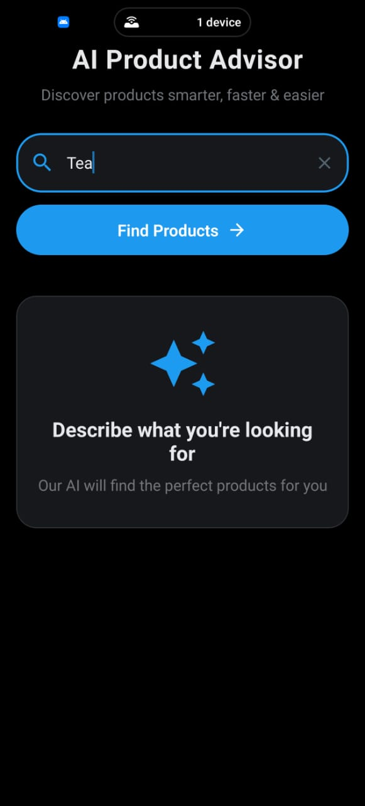
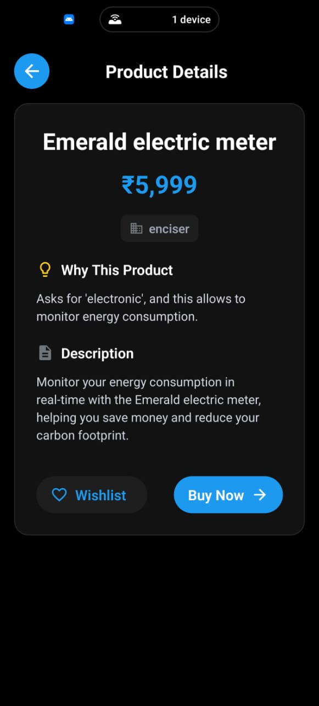
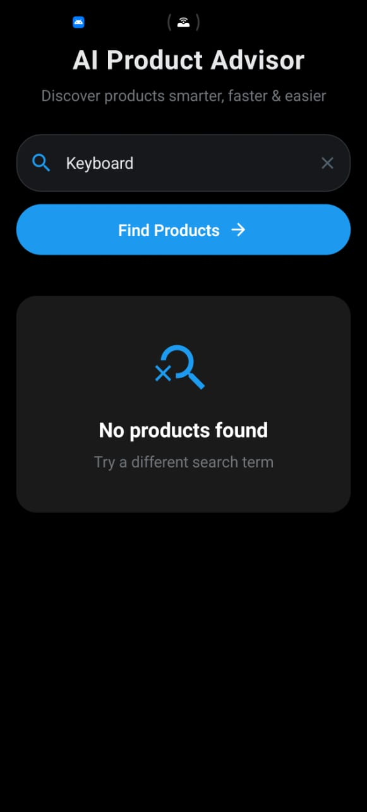
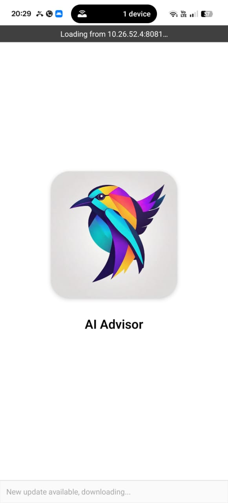
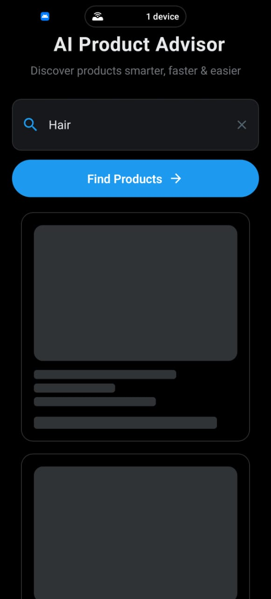

🚀 AI Advisor
Your intelligent shopping companion that understands natural language and recommends the perfect products using advanced AI.


## ✨ Intelligent Features
| Feature | Description |
|---------|-------------|
| 🎯 **Natural Language Processing** | Describe your needs in plain English - "lightweight laptop for travel with long battery life" |
| ⚡ **Real-time AI Recommendations** | Powered by Google's Gemini AI for intelligent product matching |
| 🎨 **Beautiful Animations** | Smooth transitions and engaging micro-interactions throughout |
| 📱 **Adaptive Design** | Optimized for mobile, tablet, and web with responsive layouts |
| 💾 **Smart Caching** | React Query for efficient data caching and state management |

🏗️ Architecture

The application follows a modular and layered architecture with a clear flow of data:

1. Entry Point
App.tsx initializes the app and provides navigation + theme setup.
Routes are defined to connect HomeScreen and ProductDetails.

2. Screens (UI Containers)
HomeScreen.tsx → Handles user search input, fetches product recommendations via AI, and displays results.
ProductDetails.tsx → Shows detailed information about a selected product.

3. Components (Reusable UI Blocks)
ProductCard → Displays product details in a card format.
NoDataCard → Shown when no results are found.
SkeletonLoader → Shown while fetching/loading data.
ErrorCard → Handles API or query errors.
CustomHeader, AnimatedButton → Common UI elements for navigation and interaction.

4. Data & Types
data/ProductCatalog.ts → Contains the static product dataset.
types/index.ts → Defines TypeScript models (Product, etc.) for strong typing.

5. Utils
promptBuilder.ts → Generates structured AI prompts and enforces strict JSON response format.

6. API Layer
api/apiClient.ts → Responsible for calling the AI model and handling network requests (decoupled from UI).

Data Flow

User enters a query in HomeScreen.
Query is sent to promptBuilder.ts, which creates a structured AI prompt.
Prompt is passed to apiClient.ts, which queries the AI model with the product catalog.
AI responds with a strict JSON array of product matches.
The response is validated against types/index.ts.
UI displays products via ProductCard (or NoDataCard/ErrorCard if needed).
On selection, the product details are shown in ProductDetails.tsx.

🛠️ Approach

Modular Folder Structure
Separated code into screens, components, api, constants, data, utils, and types for better maintainability and scalability.

✅ Why: Keeps logic isolated, makes debugging easier, and allows faster feature updates.

Reusable Components
Created components like ProductCard, ErrorCard, SkeletonLoader, NoDataCard, and CustomHeader.

✅ Why: Avoids code duplication and ensures a consistent UI across the app.

Prompt Builder Utility
Added a dedicated utils/promptBuilder.ts for generating AI-friendly prompts with strict JSON output.

✅ Why: Centralized logic ensures prompts are structured, reliable, and consistent across all queries.

Typed Data Models
Defined Product and other types in types/index.ts.

✅ Why: Strong typing prevents runtime errors and improves developer productivity with autocompletion.

AI Integration Strategy
The prompt explicitly enforces JSON-only responses (no extra text), making AI results easy to parse and display.

✅ Why: Eliminates ambiguity in AI responses and ensures smooth mapping to the UI.

User Experience Design
Followed a minimal, modern UI with proper error handling (NoDataCard), loading states (SkeletonLoader), and branding colors (Colors.ts).

✅ Why: Enhances trust and usability, ensuring a smooth user journey even with errors or slow network.

## 📂 Project Structure
my-ai-product-advisor/
│── App.tsx # Entry point of the app
│
└── src/
├── api/ # API layer
│ └── apiClient.ts
│
├── constants/ # App-wide constants
│ ├── Colors.ts
│ └── CustomImages.ts
│
├── screens/ # App screens
│ ├── HomeScreen.tsx
│ └── ProductDetails.tsx
│
├── components/ # Reusable UI components
│ ├── ErrorCard.tsx
│ ├── ProductCard.tsx
│ ├── SkeletonLoader.tsx
│ ├── AnimatedButton.tsx
│ ├── CustomHeader.tsx
│ └── NoDataCard.tsx
│
├── data/ # Static / mock data
│ └── ProductCatalog.ts
│
├── types/ # TypeScript types
│ └── index.ts
│
└── utils/ # Helper functions
└── promptBuilder.ts


🚀 Getting Started
### Installation

```bash
# Clone the repository
git clone https://github.com/your-username/ai-product-advisor.git

# Navigate to project directory
cd ai-product-advisor

# Install dependencies
npm install

# Start the development server
npm start


🛠️ Tech Stack
React Native (Expo)
TypeScript
TanStack React Query (API fetching & caching)
AI-powered recommendation engine
Custom UI Components (ProductCard, ErrorCard, SkeletonLoader, etc.)


🔮 Roadmap
Voice-based product search 🎤
Smarter AI suggestions 🤖
Wishlist & Save for Later 💾


## 🖼 Screenshots
Home Screen:  


Product Details:  


No Products Found:


Splash Screen:


Skeleton Effect:



👨‍💻 Author
Built with ❤️ by Anash Khan